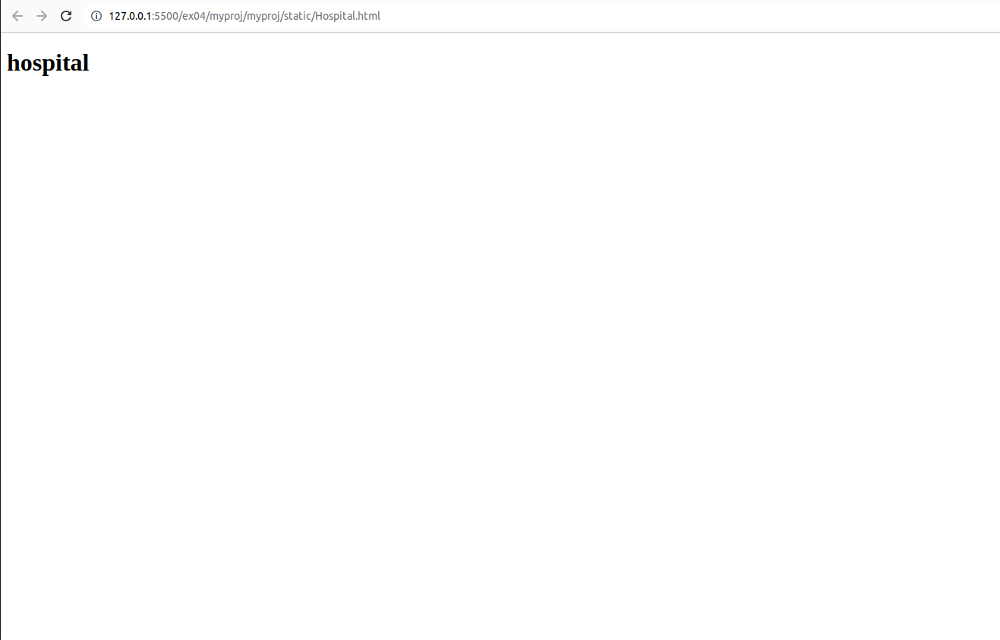
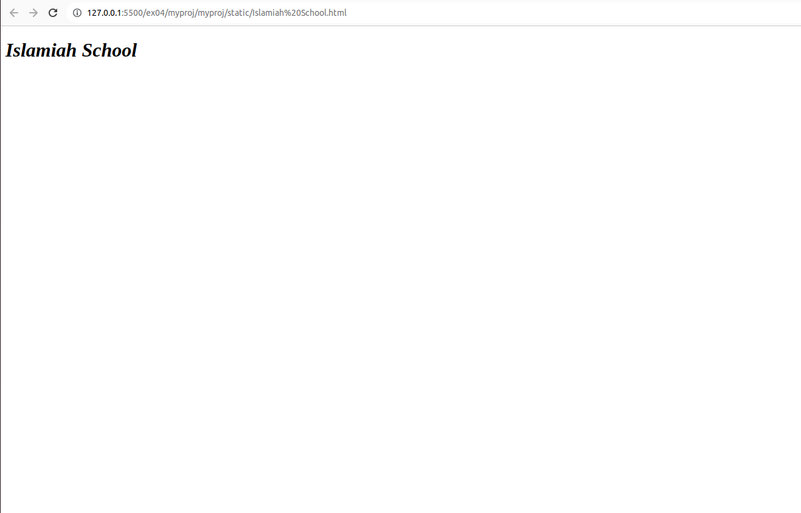

# Places Around Me
## AIM:
To develop a website to display details about the places around my house.

## ALGORITHM

1.Create a Django admin interface.


2.Download your city map from Google.


3.Using tag name the map.


4.Create clickable regions in the image using tag.


5.Write HTML programs for all the regions identified.

 
6.Execute the programs and publish them.
## Code:
### map .html
```html
<!DOCTYPE html>
<html>
<head>
    <title>IMAGEMAPS DEMO</title>
</head>
<body>

<map name="image_map">
  <area alt="Islamiah School" title="Islamiah School" href="" coords="294,229,295,230" shape="rect">
  <area alt="Hospital" title="Hospital" href="" coords="648,304,649,305" shape="rect">
  <area alt="Chennai Hot Puffs" title="Chennai Hot Puffs" href="" coords="563,407,564,408" shape="rect">
  <area alt="CM Function Hall" title="CM Function Hall" href="" coords="21,249,21,250" shape="rect">
  <area alt="SNS Hardware paints" title="SNS Hardware paints" href="" coords="466,200,467,201" shape="rect">
</map>
</body>
</html>
```
### SNS Hardware.html
```html
<!DOCTYPE html>
<html lang="en">
<head>
<title>TSNS Hardware paints</title>
</head>
<body bgcolor="white">
<h1>
<font color="gray"><I>SNS Hardware paints</I></font>
</h1>
</body>
</html>
```
### CM Function Hall.html
```html
<!DOCTYPE html>
<html lang="en">
<head>
<title>CM Function Hall</title>
</head>
<body bgcolor="white">
<h1>
<font color="blue"><I>CM Function Hall</I></font>
</h1>
</body>
</html>
```
### Chennai Hot Puffs.html
```html
<!DOCTYPE html>
<html lang="en">
<head>
<title>Chennai Hot Puffs</title>
</head>
<body bgcolor="white">
<h1>
<font color="black"><I>Chennai Hot Puffs</I></font>
</h1>
</body>
</html>
```
###  hospital.html
```html
<!DOCTYPE html>
<html>
    <head>
        <title>hospital</title>
    </head>
    <body>
        <h1 colur="red">
            hospital
        </h1>
    </body>
</html>
```
### Islamiah School.html
```html
<!DOCTYPE html>
<html lang="en">
<head>
<title>Islamiah School</title>
</head>
<body bgcolor="white">
<h1>
<font color="black"><I>Islamiah School</I></font>
</h1>
</body>
</html>
```
## Output:
### map output

### SNS Hardware output

### CM Function Hall output

### Chennai Hot Puffs output

###  hospital output

### Islamiah School

## Result:
 
 The program is completed successfully.
 
 
